# Generate Star History GitHub Action

A lightweight, standalone TypeScript GitHub Action that generates responsive, mathematically calculated SVG star history charts for your repositories with smooth CSS `@keyframes` line drawing animations and zero external binary dependencies.



## Features

- **Multi-Series Comparison Charting**: Pass a comma-separated repository list (`repository: 'owner/repo1, owner/repo2'`) to render multiple star trajectories on a single chart with a color-coded legend key.
- **Pure CSS Keyframe Animations**: Includes `@keyframes draw` stroke-dasharray animations for smooth line drawing on load, and interactive `:hover` dot scaling.
- **Rate Limit Resilience**: Built-in page-sampling algorithm that works safely on large repositories without burning your token.
- **Graceful Fallback**: Gracefully renders partial data if GitHub REST API rate limits are hit halfway.
- **Zero Native Binaries**: Pure mathematical SVG generation (no D3, no Canvas, no C++ compilation).
- **Themes**: Supports `dark`, `light`, and `auto` (uses system color scheme `@media (prefers-color-scheme)`).

---

## Action Inputs & Outputs

### Inputs

| Input          | Description                                                            | Required | Default                    |
| :------------- | :--------------------------------------------------------------------- | :------: | :------------------------- |
| `github-token` | GitHub access token (`GITHUB_TOKEN` or `PAT`)                          | **Yes**  | `${{ github.token }}`      |
| `repository`   | Target repository or comma-separated list (`owner/repo1, owner/repo2`) |    No    | `${{ github.repository }}` |
| `output-path`  | Output path for the generated `.svg` file                              |    No    | `assets/star-history.svg`  |
| `theme`        | Chart theme (`auto`, `dark`, `light`)                                  |    No    | `auto`                     |

### Outputs

| Output     | Description                                            |
| :--------- | :----------------------------------------------------- |
| `svg-path` | Absolute/relative file path to the generated SVG chart |

---

## GitHub REST APIs & Authentication Guide

This action calls the following GitHub REST API endpoints:

### Endpoints Used

1. **`GET /repos/{owner}/{repo}`**
   - **Purpose:** Fetches repository metadata and total stargazer count (`stargazers_count`).
   - **Required Permission:** `Metadata` (Read-only).

2. **`GET /repos/{owner}/{repo}/stargazers`**
   - **Purpose:** Fetches paginated stargazer timestamps (`starred_at`) with the `application/vnd.github.star+json` media header.
   - **Required Permission:** `Starring` (Read-only), `Metadata` (Read-only), and `Contents` (Read & Write).

---

### Authentication Token Setup

#### 1. Default `${{ secrets.GITHUB_TOKEN }}` (Current Repository)

For generating charts for the repository where the workflow is running, no extra setup is needed. Ensure your workflow has `contents: write` permission to commit the output SVG:

```yaml
permissions:
  contents: write
```

#### 2. Fine-Grained Personal Access Token (PAT) (Cross-Repository)

If targeting **other/external repositories** (e.g. `repository: 'kitswas/VirtualGamePad-PC, kitswas/VirtualGamePad-Mobile'`), create a Fine-grained PAT with:

- **Repository Access**: Select _All repositories_ (or explicitly add target repositories).
- **User Permissions**:
  - **Starring**: `Access: Read-only`
- **Repository Permissions**:
  - **Contents** (or **Code**): `Access: Read and write`
  - **Metadata**: `Access: Read-only`

Store this token in your repository secrets as `PAT_TOKEN` and pass it in your workflow:

```yaml
with:
  github-token: ${{ secrets.PAT_TOKEN || secrets.GITHUB_TOKEN }}
```

#### 3. Personal Access Token (Classic)

If using a Classic PAT:

- **Public Repositories**: Check **`public_repo`** scope.
- **Private Repositories**: Check **`repo`** scope.
- **Organization SSO**: If your repository is owned by a SAML SSO-enabled organization, click **Configure SSO** next to the token in Developer Settings.

---

## Usage Examples

### 1. Single Repository Setup (Current Repo)

Place this workflow in `.github/workflows/generate-star-history.yml`:

```yaml
name: Generate Star History

on:
  schedule:
    - cron: '0 0 * * 0' # Every Sunday at midnight
  workflow_dispatch:

jobs:
  star-history:
    runs-on: ubuntu-latest
    permissions:
      contents: write
    steps:
      - uses: actions/checkout@v7

      - name: Generate Star History
        uses: kitswas/generate-star-history@v1
        with:
          github-token: ${{ secrets.GITHUB_TOKEN }}
          output-path: 'assets/star-history.svg'
          theme: 'auto'

      - name: Commit and Push
        run: |
          git config user.name "github-actions[bot]"
          git config user.email "41898282+github-actions[bot]@users.noreply.github.com"
          git add assets/star-history.svg
          if git diff --staged --quiet; then
            echo "No changes to commit"
          else
            git commit -m "chore: update star history chart [skip ci]"
            git push
          fi
```

---

### 2. Multi-Repository Comparison on a Single Chart

Compare multiple repositories on a single chart with a color-coded legend:

```yaml
name: Generate Comparison Star History

on:
  schedule:
    - cron: '0 0 * * 0'
  workflow_dispatch:

jobs:
  generate-comparison:
    runs-on: ubuntu-latest
    permissions:
      contents: write
    steps:
      - uses: actions/checkout@v7

      - name: Generate Comparison Chart
        uses: kitswas/generate-star-history@v1
        with:
          github-token: ${{ secrets.PAT_TOKEN || secrets.GITHUB_TOKEN }}
          repository: 'kitswas/VirtualGamePad-PC, kitswas/VirtualGamePad-Mobile'
          output-path: 'assets/star-history-comparison.svg'
          theme: 'auto'

      - name: Commit and Push
        run: |
          git config user.name "github-actions[bot]"
          git config user.email "41898282+github-actions[bot]@users.noreply.github.com"
          git add assets/*.svg
          if git diff --staged --quiet; then
            echo "No changes to commit"
          else
            git commit -m "chore: update comparison star history chart [skip ci]"
            git push
          fi
```

---

## Local Development & Testing

You can test chart generation locally without running a GitHub Action:

```bash
# Offline single-repo mock mode
pnpm test:local

# Offline multi-series mock mode
MOCK=true REPO="mock/repo-200, mock/repo-large" pnpm test:local

# Live mode
GITHUB_TOKEN="your_pat_token" REPO="facebook/react, vuejs/core" THEME="dark" OUTPUT="assets/comparison.svg" pnpm test:local
```

### Development Commands

```bash
pnpm typecheck # TypeScript compilation check
pnpm lint      # Lint codebase
pnpm test      # Run Vitest unit tests
pnpm test:fuzz # Run property-based fuzz tests
pnpm depcruise # Verify circular dependency constraints
pnpm build     # Build production bundle using @vercel/ncc
```
